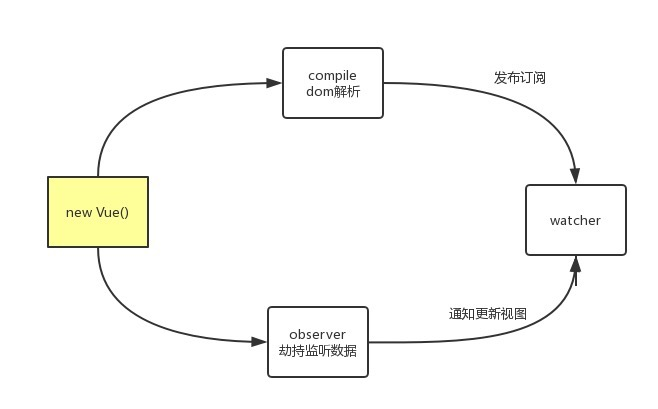

## 流程

1. new Vue 构造函数
    * 存储 $el dom元素
    * 存储 data 数据
    * 存储 watcherTaks 数组
2. 数据代理，将响应式数据通过  definePropertype “挂载”到vue实例
3. 劫持监听 响应式数据，在 set 数据发生改变时，批量将与该响应式数据相关联的 watcher 执行update进行视图更新
4. 调用 compile 解析dom，对根元素 dom 进行判断，对其子元素进行递归调用，对于带有 v-html， @click，v-modle 等指令的 生成相对应的 watcher 添加到 watcherTasks 数组。